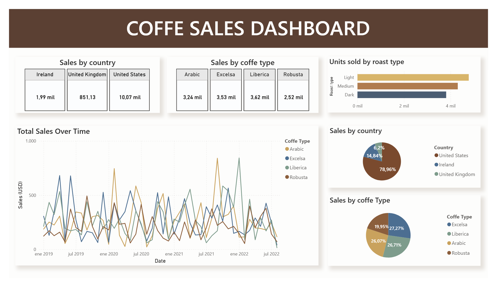

# Coffee Sales Analysis — Data Cleaning & Dashboard (Google Sheets + Power BI)

This project is a practical example of data cleaning, mapping, and visualization using **Google Sheets** and **Power BI**.  
The objective is to transform raw sales data into a clear and interpretable dashboard that supports business-oriented analysis.

---

  

---

## 📊 Project Overview

The dataset represents a fictional **coffee sales study**, including information about orders, customers, products, and sales performance across different countries and coffee characteristics.

The workflow covers:
- Data preparation and table integration in **Google Sheets**
- Data cleaning and validation
- Exploratory analysis using pivot tables
- Interactive dashboard creation in **Power BI**

---

## 🗂 Raw Data

The original data was provided in **three separate sheets**, containing sales, customer, and product information.

After processing, the final dataset includes the following variables:

- Order ID  
- Order Date  
- Customer ID  
- Product ID  
- Quantity  
- Customer Name  
- Email  
- Country  
- Coffee Type  
- Roast Type  
- Size  
- Unit Price  
- Sales  
- Coffee Type Name  
- Roast Type Name  

---

## 🧹 Data Cleaning & Mapping (Google Sheets)

Data preparation was performed entirely in **Google Sheets**, focusing on clarity, traceability, and reproducibility.

Key steps included:

- Merging multiple sheets into a single analytical table  
- Mapping product and category information using:
  - `XLOOKUP`
  - `INDEX` & `MATCH`
  - `IF` logical conditions
- Formatting dates, numeric values, and currency fields
- Verifying and removing duplicates (none found)
- Creating a **pivot table** and basic plot for initial exploration

This step ensured the dataset was analysis-ready before moving to Power BI.

---

## 📈 Data Visualization (Power BI)

The cleaned dataset was imported into **Power BI** to build an interactive dashboard focused on sales performance.

The dashboard includes:
- Coffee sales over time
- Sales by country
- Sales by coffee type
- Sales by roast type

The goal was to provide a clear overview of trends and patterns, enabling quick comparisons and high-level insights.

---

## 🛠 Tools & Technologies

- **Google Sheets** (data cleaning, mapping, pivot tables)
- **Power BI** (data modeling & dashboard creation)
- Spreadsheet formulas: `XLOOKUP`, `INDEX`, `MATCH`, `IF`

---

## 🎯 Purpose

This project demonstrates a complete, real-world workflow:
from raw data preparation to final visualization, using commonly adopted tools in data analysis roles.

It is intended as a portfolio example for **data analyst positions**, particularly in business, healthcare, or applied analytics contexts.

---

📧 [israelddh@hotmail.com](mailto:israelddh@hotmail.com)  
🔗 [LinkedIn](https://www.linkedin.com/in/israel-duarte/)  
🆔 [ORCID Profile](https://orcid.org/0000-0001-5427-6019)

---

  
  
  

